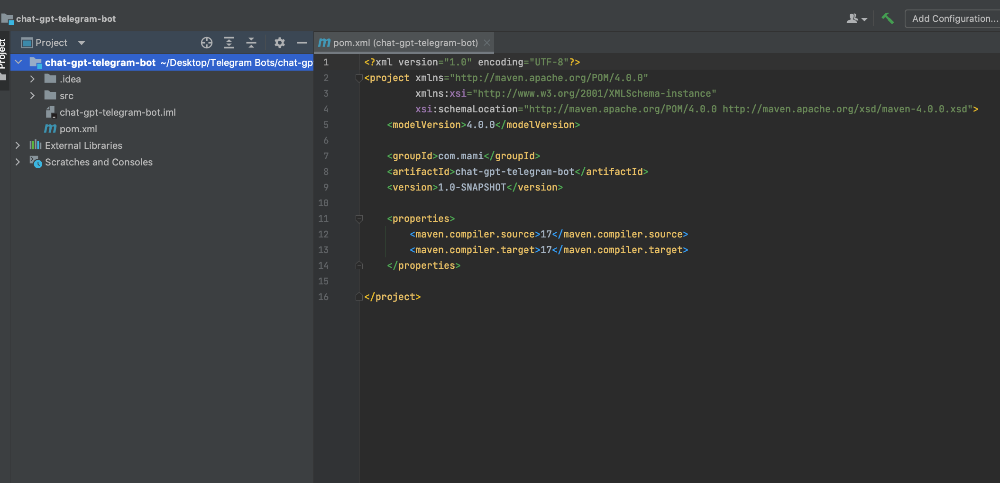
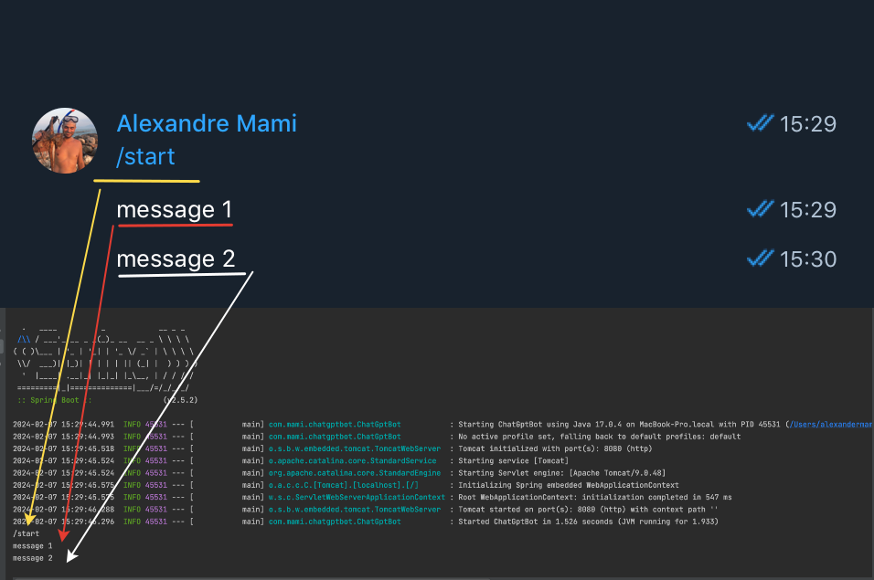

# Building a Telegram Bot with ChatGPT Integration Using Spring Boot 2.5.2

This repository features a concise tutorial on building a basic Telegram bot. Learn how to seamlessly integrate it 
with Spring Boot 2.5.2 and leverage the functionality of the [OpenAI-Java](https://github.com/TheoKanning/openai-java) 
library. Follow along step-by-step to create your own interactive bot capable of interacting intelligently with users.

At the end of this tutorial, you'll have a fully functional Telegram bot similar to the one described in the 
upcoming video.

As you see , the answer received by the bot is not complete. I think it's due to the  OpenAI-Java library.
I will make another same repo with another implementation. 

As you can observe, the response received by the bot appears to be incomplete. I suspect this issue may be related to 
the OpenAI-Java library. Therefore, I plan to create a new repository with a different implementation.

### 1 - Create the project
In Idea create a new Maven project

We will have a pom.xml file which we will change.

Editing the pom.xml file

Create main class , the entry point of our application

### 2 - BotFather
You have to find the BotFather in Telegram.
Pay attention to the official BotFather

### 3 - Add Telegram Dependency
Edit pom.xml file
Add Telegram and lombok  dependencies

### 4 - Creating our bot

Two ways to create bots (Polling and Webhooks)
I will touch the Polling.
Create new package `controller` and a new class `TelegramBot`that will
extend a class from Telegram `TelegramLongPollingBot` and override three methods

After the app started 

### 5 - Implementing The Telegram ChatGPT Bot Version 1

 1 - First, let's refactor and export token and username to `application.properties`
file. Let's create it in `resources` folder .

 2 - Remove hardcoded data from `TelegramBot` class

 3 - Write implementation 

private methods

running the app

Now let's write code using OpenAi

We have to generate an OpenAI API key.
If you don't have one, you can sign up for it on the OpenAI website.

I have found a library on git but it seems that his library does not work fine.
Add new dependency in `pom.xml` file.

Let's remove hardcoded tokens from `.properties` file and set it to env variables.
I will not show you how to do it you can google it yourself.

Now we will add configuration to Openai API

Now let's inject `OpenAiService` bean in our `TelegramBot`

 Let's implement  `getResponseFromChatGPT()`

Before finish, let's make our bot more beautiful and functional.
Inside method `onUpdateReceived()` , we will write three commands that our 
bot will accept.

Static text

Method chatGptCommandReceived()

Method getResponseFromChatGpt()

Method sendTextMessage()

Method processPromptResponse()

Now we will add menu like this.

For this we will export configs for Telegram Bot to a separate class and inject it into `TelegramBot` class.
Create a new `BotConfig.java`  class.

Make some changes in `TelegramBot.java` class.

Let's run the App.

